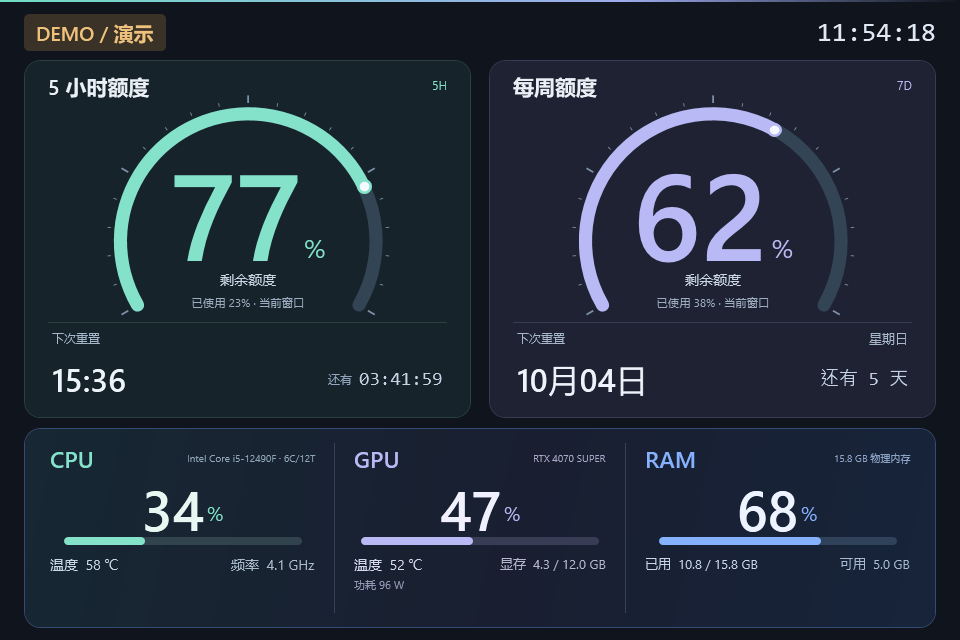

# GPT + Hardware 副屏驾驶舱 · 本地硬件版

为 960×640 横向副屏设计的原生 Windows 面板。上方保持 Codex 5 小时与每周额度仪表盘，下方每秒刷新 CPU、GPU 和物理内存状态。



此分支为本地实验版本，不推送或发布到 GitHub。原有 DeepSeek 版本保留在 `main` 分支。

## 显示内容

- CPU：实时使用率、核心/线程数、频率和温度。
- GPU：实时使用率、核心温度、显存占用和功耗。
- RAM：实时使用率、已用容量、总容量和可用容量。
- Codex：5 小时及每周剩余额度、重置时间和倒计时，逻辑与原版一致。

硬件数据每秒在本机读取，不上传到任何服务。Codex 额度仍通过本机已登录的官方 App Server 接口获取。

## 传感器说明

硬件传感器使用 LibreHardwareMonitorLib 0.9.6。GPU 数据在当前 RTX 4070 SUPER 上可读取温度、显存和功耗；Windows 系统接口作为降级来源。

当前主板在普通用户权限下没有向 LibreHardwareMonitor 提供 CPU 温度，因此本机显示 `-- ℃`。面板不会把 ACPI 机箱环境温度误标成 CPU 温度。CPU 使用率、频率及其他硬件数据不受影响；若以后传感器库在当前权限下提供该数据，面板会自动显示。

依赖位于 `vendor/LibreHardwareMonitor`，版本由 `packages.lock.json` 锁定。LibreHardwareMonitor 使用 MPL-2.0 许可证。

## 启动与构建

源码模式双击 `Start.cmd`。构建独立 EXE：

```powershell
powershell.exe -NoProfile -ExecutionPolicy Bypass -File .\build\Build.ps1
```

默认输出为项目上级目录的 `QuotaCockpit-Hardware.exe`。程序使用 Windows PowerShell 5.1 与 WPF，不需要管理员权限。首次运行将内置文件释放到 `%LOCALAPPDATA%\GptHardwareCockpit\App`，配置保存在 `%LOCALAPPDATA%\GptHardwareCockpit\config.json`。

可用参数：

- `--demo`：显示演示数据。
- `--windowed`：以普通窗口启动。
- `--self-test`：验证 EXE 内置文件。
- `--smoke-test`：运行界面冒烟测试。

## 操作

| 操作 | 快捷键 |
| --- | --- |
| 立即刷新额度与硬件状态 | R |
| 切换全屏 / 窗口 | F11 |
| 从全屏回到窗口 | Esc |
| 切换至下一块显示器 | Ctrl + Tab |
| 切换窗口置顶 | T |
| 退出 | Q 或 Alt + F4 |

右键面板也可执行刷新、切换屏幕、置顶、窗口切换和退出。

## 测试

```powershell
Get-ChildItem .\tests\*.Tests.ps1 | ForEach-Object {
    powershell.exe -NoProfile -ExecutionPolicy Bypass -File $_.FullName
}
```

`Hardware.Tests.ps1` 会在本机读取一次真实传感器并检查数值范围，不会输出凭证或向外部发送硬件数据。
