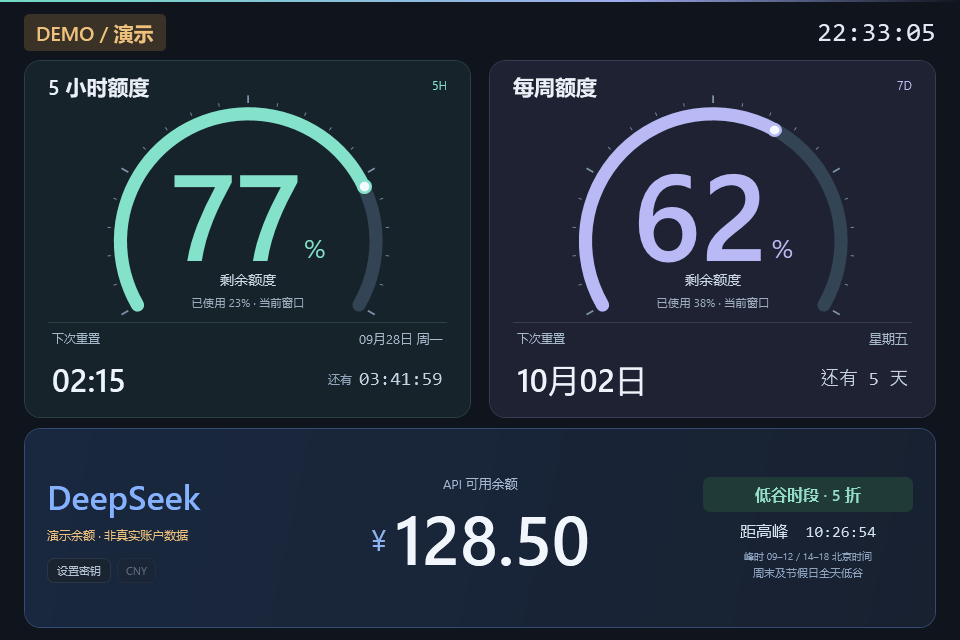

# GPT + DeepSeek 副屏驾驶舱 · Windows 版

为 **960 × 640 横向副屏**制作的原生 Windows 面板，上方约三分之二展示 Codex 账户额度，下方约三分之一展示 DeepSeek API 可用余额。使用 Windows 自带的 Windows PowerShell 5.1 与 WPF，无需安装 Python、Node.js 或浏览器插件。



## 下载

普通用户可从 GitHub Releases 下载 `QuotaCockpit.exe`，双击运行。源码用户也可以克隆仓库后运行 `Start.cmd`，或执行 `build/Build.ps1` 自行构建。

上方显示的是当前登录账户的 **Codex 额度**。常见配额窗口为 5 小时与一周；实际窗口、剩余比例与重置时间以服务端返回为准。它不能汇总 ChatGPT 网页中每种模型的消息额度，也不是 API 余额或 token 钱包。

## EXE 直接启动

双击发布包中的 **QuotaCockpit.exe** 即可启动，无需保留源码文件夹，仍需本机安装并登录 Codex。使用 Windows 自带运行环境，不需管理员权限，当前未做数字签名。

首次运行释放程序到 `%LOCALAPPDATA%\GptQuotaMonitor\App`，配置保存到 `%LOCALAPPDATA%\GptQuotaMonitor\config.json`，继续使用已有的本机加密 DeepSeek 密钥。`--settings` 打开配置，`--demo` 查看演示，`--windowed` 窗口启动。下方是源码版备用入口。

## 第一次启动

1. 将整个 `gpt-quota-monitor` 文件夹放在固定位置；如果收到 ZIP，先完整解压。
2. 确认这台电脑安装了 Codex，并已通过 ChatGPT 账户登录。面板会寻找 PATH 中的 Codex 或 Codex 桌面应用附带的程序。
3. 双击 **`Start.cmd`**，等待首次读取完成。正常启动后不会留下命令行窗口。
4. 如果面板出现在错误的屏幕，先单击面板，再按 **Ctrl + Tab** 切换屏幕。

只看界面时可双击 **`Start-Demo.cmd`**。演示模式会明确标记，使用独立的示例数据，不会代替真实读取结果，也不要求已登录。

## 副屏驾驶舱模式

两组额度采用 240° 仪表盘：大号半粗体数字显示剩余百分比，粗弧线、刻度和亮点对应 0–100% 剩余额度。低于或等于 20% 变为琥珀色，低于或等于 5% 变为红色。缺失数据保留空轨道，不显示虚假的指示点。

5 小时窗口显示重置时刻及倒计时；每周窗口只显示重置日期、星期与剩余日历天数，不显示具体钟点。日期按本地时区计算，到期仍等待服务确认，绝不自行补满额度。界面适配 960×640，其他窗口尺寸整体等比缩放。

## 副屏设置与操作

在 Windows「设置 → 系统 → 屏幕」中，将小屏设为 **扩展这些显示器、960 × 640、横向、100% 缩放**，可得到设计尺寸下的效果。程序会处理 Windows 的显示缩放与多显示器坐标，不需要把副屏固定放在主屏右侧；位于左侧、上方或下方都可以。

默认先选择分辨率恰好为 960 × 640 的副屏，再选择其他副屏；只有一块屏幕时使用主屏。当前环境检测到主屏为 3440 × 1440，小屏为 960 × 640，左上角坐标为 `(2269, 1440)`，即主屏下方；这些坐标没有硬编码到面板中。

先单击面板使其获得键盘焦点，再使用快捷键：

| 操作 | 快捷键 |
| --- | --- |
| 切换全屏 / 窗口 | F11 |
| 从全屏回到窗口 | Esc |
| 切换至下一块显示器 | Ctrl + Tab |
| 立即刷新额度 | R |
| 切换窗口置顶 | T |
| 退出面板 | Q 或 Alt + F4 |

## 数据如何读取

面板通过本机 Codex 的官方 App Server `account/rateLimits/read` 接口读取当前账户额度，优先使用所选 `limitId` 对应的配额数据。剩余比例为 `100 − usedPercent`，重置时间来自 `resetsAt`，并按 Windows 本地时区显示。默认每 60 秒获取一次最新额度。

Codex 区域不需要填 API Key，也不需要复制 Cookie、登录令牌或认证文件。面板不提取认证文件内容；登录与认证由 Codex 自己处理。额度查询不会发起模型对话。未返回的数据不会被当作“额度全满”。

刷新失败时，面板可以保留本次运行中最后一次成功读取的数值，并明确标记数据已过期；不要把旧数值当成实时结果。额度不会缓存到磁盘，重启后会重新读取。正常网络错误直接显示在面板上。

接口说明见 [OpenAI 官方 Codex App Server 文档](https://learn.chatgpt.com/docs/app-server)。

## 连接 DeepSeek

点击面板右下区域的 **设置密钥**，或双击 `Set-DeepSeekKey.cmd`，粘贴 DeepSeek 开放平台 API Key 并保存。保存成功后面板会自动连接，无需重启。两家服务独立刷新，一方断网不影响另一方。

DeepSeek 使用官方 `GET https://api.deepseek.com/user/balance`，仅展示原币种的可用总余额。金额不是百分比，不推算可用 token，也不做汇率换算；账号返回多个币种时，可点击币种按钮切换。每 60 秒刷新一次，R 同时刷新两家数据。失联时明确标记旧余额；更换密钥时先清除旧账户读数。

API Key 使用 Windows 当前用户 DPAPI 加密，保存在 `%LOCALAPPDATA%\GptQuotaMonitor\deepseek-key.dpapi`。不写入 `config.json`、项目目录或 ZIP。保存前验证可解密，错误提示不会显示密钥或原始接口响应。新电脑需要重新设置；不要把 API Key 发到聊天或分享文件中。

没有本机已保存的密钥时，也支持读取当前进程或当前用户的 `DEEPSEEK_API_KEY` 环境变量。已保存密钥优先。若设置窗口遇到问题，可在项目文件夹内运行以下隐藏输入入口：

```powershell
powershell.exe -NoProfile -STA -ExecutionPolicy Bypass -File .\Set-DeepSeekKey.ps1 -Console
```

密钥无效、网络错误、接口限流和服务未提供余额分别显示明确状态。API Key 仅发送给固定官方余额地址，禁用重定向，不调用模型。

接口说明：[DeepSeek 官方余额查询文档](https://api-docs.deepseek.com/zh-cn/api/get-user-balance/)。

## 配置

用记事本打开同目录下的 `config.json`，修改后重新启动面板即可。`config.example.json` 提供默认值备份。

```json
{
  "pollSeconds": 60,
  "codexPath": "",
  "limitId": "codex",
  "screenIndex": -1,
  "topmost": false,
  "windowed": false
}
```

| 字段 | 含义 |
| --- | --- |
| `pollSeconds` | 额度刷新间隔，单位为秒。推荐保留 60。 |
| `codexPath` | 空字符串表示自动寻找 Codex；若自动寻找失败，填写 Codex 可执行程序的完整路径。JSON 中的反斜杠需要写成 `\\`，例如 `C:\\Tools\\Codex\\codex.exe`。 |
| `limitId` | 默认 `codex`。不同额度池不能相互代替；只在确认账户提供其他额度池时修改。 |
| `screenIndex` | `-1` 表示自动选择；`0`、`1` 等表示程序检测列表中的屏幕序号，不一定等同于 Windows 设置中的显示器编号。 |
| `topmost` | `true` 表示启动时保持置顶。默认 `false`。 |
| `windowed` | `true` 表示以普通窗口启动。默认 `false`，以全屏启动。 |

也可以在项目文件夹的 PowerShell 中运行：

```powershell
# 用窗口模式启动
powershell.exe -NoProfile -ExecutionPolicy Bypass -File .\Launch.ps1 -Windowed

# 指定程序检测列表中的第二块显示器
powershell.exe -NoProfile -ExecutionPolicy Bypass -File .\Launch.ps1 -ScreenIndex 1

# 使用另一份配置（相对路径按项目文件夹解析）
powershell.exe -NoProfile -ExecutionPolicy Bypass -File .\Launch.ps1 -ConfigPath .\config.json
```

启动脚本只为本次进程设置执行策略，不修改系统全局设置。路径包含空格或中文时也可以直接使用。

## 登录 Windows 后自动启动

项目默认不启用自启动。

- **启用：**双击 `Enable-Autostart.cmd`。它会在当前 Windows 用户的「启动」文件夹创建 `GPT Quota Monitor.lnk`，下次登录生效，不需要管理员权限。
- **关闭：**双击 `Disable-Autostart.cmd`。它只删除上述快捷方式，不会关闭已经运行的面板。
- **移动项目后：**在新位置再运行一次 `Enable-Autostart.cmd`，更新快捷方式。

自启动使用真实数据模式及 `config.json` 中的设置。关闭面板后，本次登录不会自动重新拉起；需要时再双击 `Start.cmd`。

## 故障排查

**双击后没有面板：**运行 `Diagnose.cmd`，诊断信息会留在命令行窗口，按键后才关闭。它会检查运行环境、列出屏幕序号和实际边界，并读取一次额度摘要，不会打开面板。保留完整项目目录，不要只复制一个启动脚本。致命启动错误会记录到 `%LOCALAPPDATA%\GptQuotaMonitor\startup-error.txt`。

**找不到 Codex：**先确认桌面应用已安装，或在 PowerShell 中确认 `codex --version` 可运行。必要时设置 `config.json` 中的 `codexPath`。

**提示未登录或无法读取额度：**打开 Codex，确认当前账户已通过 ChatGPT 登录；CLI 用户可运行 `codex login`。然后回到面板按 R。网络异常时恢复连接后重试。仅使用 API Key 的账户不提供这里要显示的订阅额度。

**显示“暂无数据”或某个窗口为空：**服务端没有返回该项额度，不能据此推断剩余额度为零或 100%。核对账户及 `limitId`，并查看诊断结果。

**小屏不满屏或显示位置不对：**检查扩展显示、分辨率、方向与缩放；按 Ctrl + Tab 选择屏幕，按 F11 切换全屏。显示器接线、排列或缩放更改后，重新启动面板。

**启动被系统策略阻止：**组织管理的设备可能限制本地脚本；请按设备既有管理要求处理。程序不需要管理员运行。

## 文件说明

| 文件 | 用途 |
| --- | --- |
| `Start.cmd` | 双击启动真实额度面板。 |
| `Start-Demo.cmd` | 双击启动明确标记的演示模式。 |
| `Monitor.ps1` | 原生 WPF 面板与运行入口。 |
| `Dashboard.xaml` | 面板布局与视觉样式。 |
| `DeepSeekSource.ps1` / `DeepSeekPanel.ps1` | DeepSeek 余额读取、独立刷新与展示。 |
| `Set-DeepSeekKey.ps1` / `Set-DeepSeekKey.cmd` | 本机加密密钥设置。 |
| `QuotaSource.ps1` | 通过本机 Codex 读取额度并整理显示数据。 |
| `Launch.ps1` | 隐藏命令行窗口的启动器。 |
| `config.json` / `config.example.json` | 当前配置 / 默认配置示例。 |
| `Diagnose.cmd` | 运行诊断并保留输出。 |
| `Autostart.ps1` | 管理当前用户的自启动快捷方式。 |
| `Enable-Autostart.cmd` / `Disable-Autostart.cmd` | 启用 / 关闭自启动。 |

退出面板并关闭自启动后，即可删除整个项目文件夹。

## 简洁界面与暂停同步

标题、顶部状态行、同步时间与底部按钮已收起。右键可刷新、切换屏幕、置顶、切换窗口或退出，快捷键继续有效。GPT 连接详情在左上标识的悬停提示中。

GPT 任一窗口额度耗尽后暂停整个账户的自动查询，保留两项最后读数，到耗尽窗口重置时自动恢复。两项均耗尽时等待两项均到重置时刻。缺少重置时间时等待手动刷新。重置后以服务器读数为准，不自行补满。

DeepSeek 余额耗尽或服务标记不可用时暂停查询。余额没有固定重置周期，充值后按 R 或右键刷新恢复。R 可以主动查询两家服务，重启也会重新查询一次。暂停不会误标数据过期，时钟、倒计时和峰谷提醒继续更新。

## DeepSeek 峰谷提醒

按[官方计价说明](https://api-docs.deepseek.com/quick_start/pricing)，北京时间周一至周五 09–12 / 14–18 为高峰，其他时段、周末和中国法定节假日为低谷，低谷价格为高峰的一半。

规则于 2026-09-27 核对，内置 2026 年节假日日历。未来年份未配置时显示规则待更新，不猜测。提醒来自本地规则，不代表实时账单，规则变动需更新 pricing-rules.json。

源码包保留 build/Build.ps1 和启动器源码，可用 Windows PowerShell 重新构建 EXE。打包清单不包含密钥或真实账户截图。
